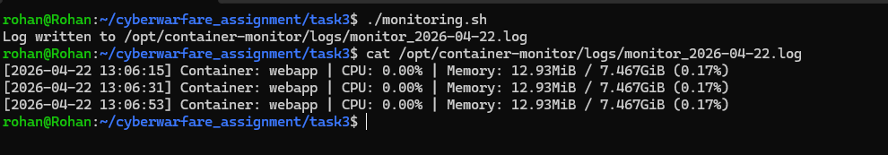
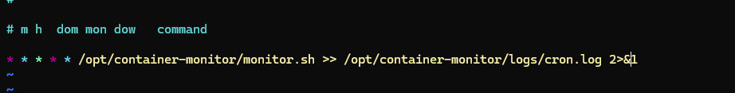
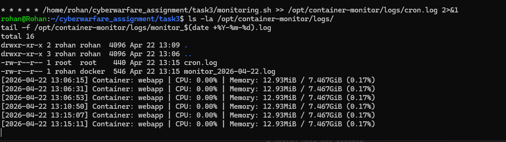

# Task 3 — Container Monitoring

## What I Did
Wrote a bash script that logs container CPU and memory usage with timestamps, and automated it with a cron job that runs every minute.

---

## Files
- `monitoring.sh` — the script

---

## Steps

**1. Create the log directory**
```bash
sudo mkdir -p /opt/container-monitor/logs
sudo chown -R $USER:$USER /opt/container-monitor
```

**2. Copy script and make it executable**
```bash
cp monitoring.sh /opt/container-monitor/monitor.sh
chmod +x /opt/container-monitor/monitor.sh
```

**3. Test manually**
```bash
/opt/container-monitor/monitor.sh
cat /opt/container-monitor/logs/monitor_2026-04-22.log
```

**4. Set up cron job (every minute)**
```bash
sudo crontab -e
```

Added:
```
* * * * * /opt/container-monitor/monitor.sh >> /opt/container-monitor/logs/cron.log 2>&1
```

**5. Verify cron is set**
```bash
sudo crontab -l
```

---

## Output

<div align="center">
  
</div>
<div align="center">
  
</div>
<div align="center">
  
</div>
---

## Result
- Script captures CPU, memory, timestamp
- Logs stored in `/opt/container-monitor/logs/`
- Cron job runs every minute automatically
