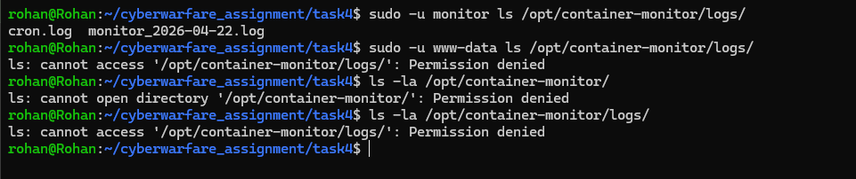

# Task 4 — Access Control for Monitoring Logs

## What I Did
Created a dedicated `monitor` user, gave it full ownership of the monitoring directory, set strict permissions so only that user can access the logs, and verified other users are blocked.

---

## Steps

**1. Create the monitor user**
```bash
sudo useradd -r -s /bin/bash -m -d /home/monitor monitor
```

**2. Give ownership to monitor user**
```bash
sudo chown -R monitor:monitor /opt/container-monitor
```

**3. Set permissions**
```bash
sudo chmod 750 /opt/container-monitor
sudo chmod 700 /opt/container-monitor/logs
```

What these mean:
- `750` on main dir — monitor has full access, others have none
- `700` on logs dir — only monitor can read/write logs

**4. Add monitor to docker group**
```bash
sudo usermod -aG docker monitor
```

**5. Set cron for monitor user**
```bash
sudo -u monitor crontab -e
```
Added:
```
* * * * * /opt/container-monitor/monitor.sh
```

---

## Output

<div align="center">
  
</div>

## Result
- `monitor` user created
- Owns `/opt/container-monitor` completely
- Logs directory restricted to `monitor` only
- All other users blocked
