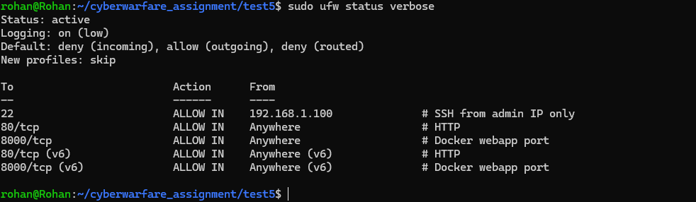

# Task 5 — Firewall Configuration (UFW)

## What I Did
Installed UFW, set default deny policy, and added rules to allow SSH from a specific IP, HTTP on port 80, and the Docker app on port 8000.

---

## Steps

**1. Install UFW**
```bash
sudo apt install -y ufw
```

**2. Set default policies**
```bash
sudo ufw default deny incoming
sudo ufw default allow outgoing
```

**3. Add rules**
```bash
# SSH only from admin machine
sudo ufw allow from 192.168.1.100 to any port 22 comment 'SSH from admin IP only'

# HTTP
sudo ufw allow 80/tcp comment 'HTTP'

# Docker webapp
sudo ufw allow 8000/tcp comment 'Docker webapp port'
```

**4. Enable**
```bash
sudo ufw enable
```

**5. Verify**
```bash
sudo ufw status verbose
```

---

## Output

<div align="center">
  
</div>

## Result
- UFW active with deny-all default
- SSH restricted to specific IP only
- HTTP (80) and app port (8000) open
